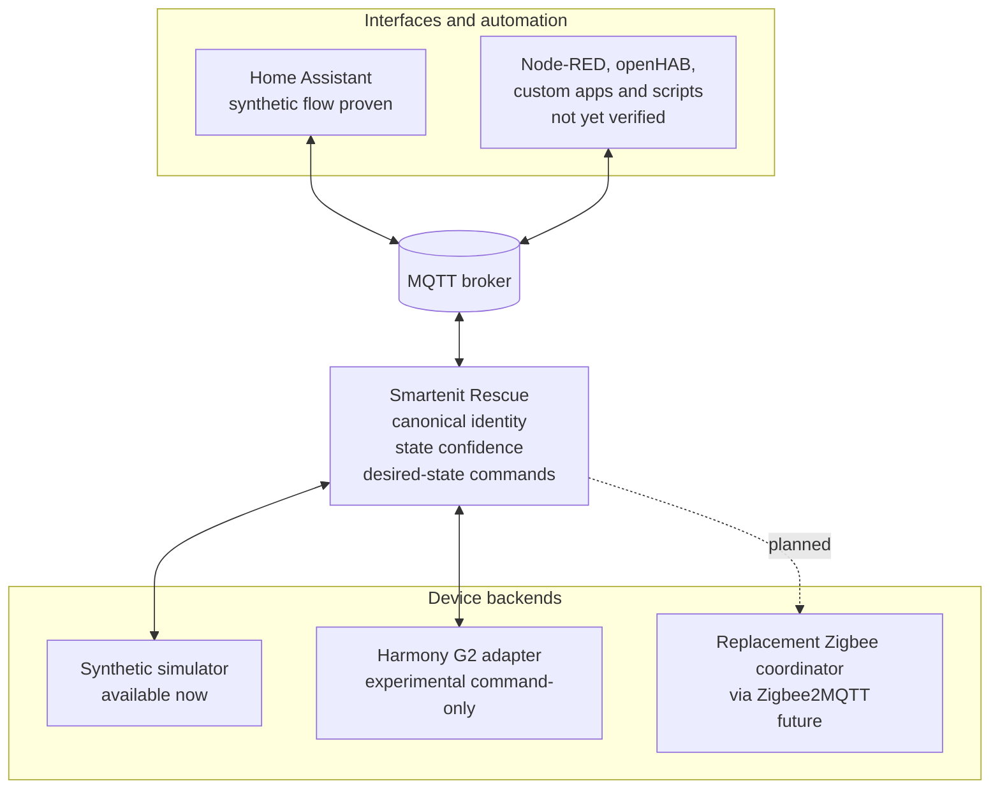

# Smartenit Rescue

**Unofficial community project.** Smartenit Rescue is an independent user
contribution. It is not affiliated with, sponsored by, endorsed by, or supported
by Smartenit, Inc. or Compacta International, Ltd. Vendor and product names are
used only to identify the devices discussed here.

Smartenit Rescue aims to help owners of Smartenit controllers who can no longer use
the original iOS or Android apps. Its first objective is to provide a foundation for
bridging supported controllers into Home Assistant or other home-automation software
through MQTT. It is a bridge, not a replacement phone app or an automation dashboard.

The second objective is a direct-controller path using this software and a replacement
Zigbee coordinator, without the Harmony G2 hardware or Smartenit cloud. That path is
planned, not implemented. This public repository contains synthetic fixtures and
publicly reviewed behavior, not private installation data.

## Status and scope

This project is pre-release software. It runs a foreground MQTT bridge with a reserved
simulator and an experimental, LAN-only Harmony G2 backend. The simulator proves an
observable switch path. The G2 backend proves certificate-pinned local renewal,
inventory, and command-only Home Assistant behavior with generated fixtures; no
physical device or gateway has verified public support yet. Compatibility claims are
tracked explicitly as `synthetic`, `experimental`, or `hardware_verified`.

**Choose your starting point:**

- To learn and verify the Home Assistant integration without touching a controller,
  follow the [synthetic first-run guide](docs/home-assistant.md#run-the-synthetic-proof).
- If you have a Harmony G2 and an existing, locally renewable session, check the
  [G2 eligibility requirements](docs/harmony-g2.md#can-i-use-the-g2-backend-today).
  Its On/Off actions are experimental and do not report physical load state.
- If you have only an account email and password, this release cannot establish the
  first G2 local session. The [G2 guide](docs/harmony-g2.md) explains this boundary.
  The alternate-coordinator backend is future work, so this repository is not yet a
  turnkey recovery route for that case.

## Safety boundary

This is experimental software that may command mains-powered equipment. It is not
a safety device or emergency shutoff. Do not rely on a software command or reported
state as the sole means of confirming a load is off; verify physical state and retain
an appropriate independent disconnect. Leave electrical installation and changes to
qualified personnel. Assess compatibility and safe use before connecting real loads.
The software is provided "as is" under the [MIT License](LICENSE), which contains
the applicable warranty disclaimer and limitation of liability.

This package contains no vendor credentials or cloud bootstrap. It does not perform a
command during module import, discovery, startup, reconnect, shutdown, or automatic
retry. Both backends accept only explicit `ON` and `OFF` desired-state commands
received from MQTT.

## Local development

Create a local editable installation from the checkout for development:

```sh
uv sync --extra dev
```

Install the command-line tool directly from a local checkout:

```sh
uv tool install .
```

## Device profiles

List the built-in profiles without contacting any device or network service:

```sh
smartenit-rescue profiles list
```

Validate a local profile against the closed profile schema:

```sh
smartenit-rescue profiles validate path/to/profile.json
```

Support labels communicate the evidence available for each capability:

- `synthetic`: validated only through fixtures and public documentation.
- `experimental`: exercised with hardware, but not sufficiently verified for a stable
  compatibility claim.
- `hardware_verified`: verified against hardware with reproducible evidence.

The built-in 4040C profile remains synthetic evidence. Backend and model support are
separate claims:

| Backend | Model/capability | Current evidence |
| --- | --- | --- |
| Simulator | 4040C-compatible On/Off | `synthetic` |
| Harmony G2 | 4040C On/Off | `experimental` |
| Harmony G2 | Metering or other controller models | unsupported |
| Zigbee2MQTT | Direct-controller integration | future work; no hardware verification |

The Harmony G2 row requires an externally provisioned local session; cold bootstrap
is not supported. See the [Harmony G2 guide](docs/harmony-g2.md) for the retained
session, certificate enrollment, exact mapping, and acceptance boundaries.

## Synthetic Home Assistant proof

All deployment modes run the same foreground command:

```sh
smartenit-rescue run --config path/to/config.toml
```

Start from a private copy of `config.example.toml`, supply broker secret files or
remove both credential-file settings for an unauthenticated local broker, and keep
the example's reserved synthetic 4040C-compatible switch. The
[Home Assistant first-run guide](docs/home-assistant.md) covers the synthetic and G2
presentations. The [operations guide](docs/operations.md) covers terminal, systemd,
launchd, and Docker usage. The G2 configuration example stays separately sanitized
and non-runnable in [docs/harmony-g2.md](docs/harmony-g2.md).

## Architecture

The project is designed as a thin, backend-neutral interoperability bridge rather
than another home-automation platform. Its canonical device model, state-confidence
rules, evidence-backed profiles, planned backend boundary, and Home Assistant/MQTT
direction are described in [docs/architecture.md](docs/architecture.md).

### Building integrations on the bridge

Smartenit Rescue exposes an MQTT and canonical-device boundary. The Home Assistant
synthetic flow has been tested. Node-RED, openHAB, custom apps, scripts, and other
MQTT consumers are possible integration targets but have **not** been tested or
verified with this release.



The [synthetic proof flow](docs/architecture.md#proving-the-bridge-without-hardware)
shows how commands, observations, availability, and restart recovery cross this
boundary without physical hardware.

## Governance

See `SECURITY.md`, `CONTRIBUTING.md`, and `CODE_OF_CONDUCT.md`.
