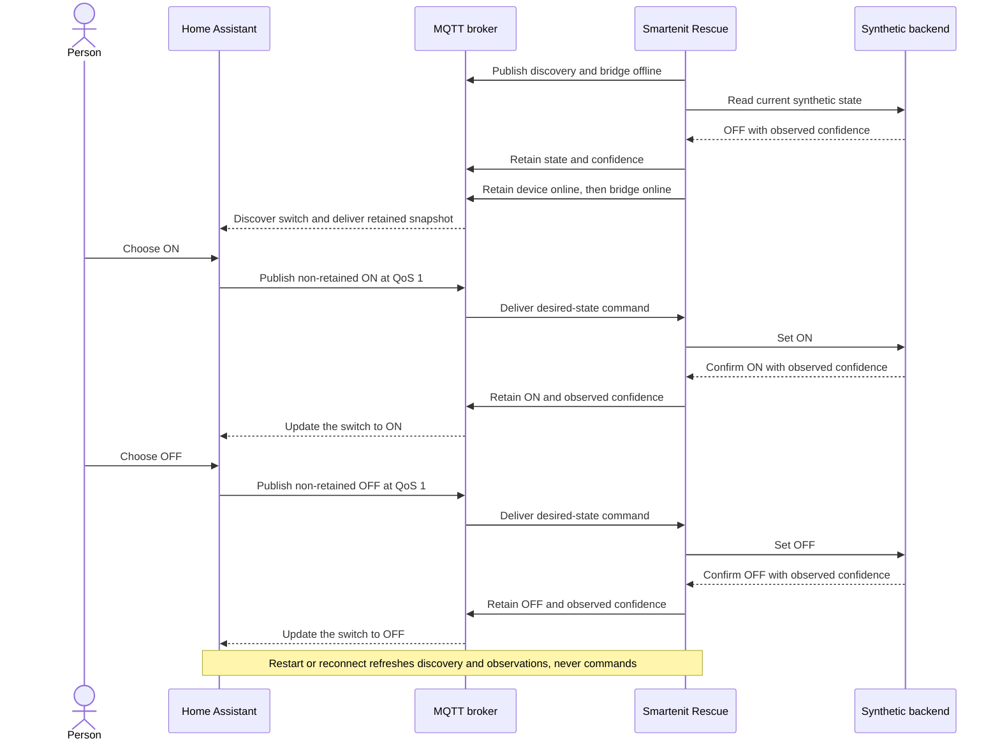
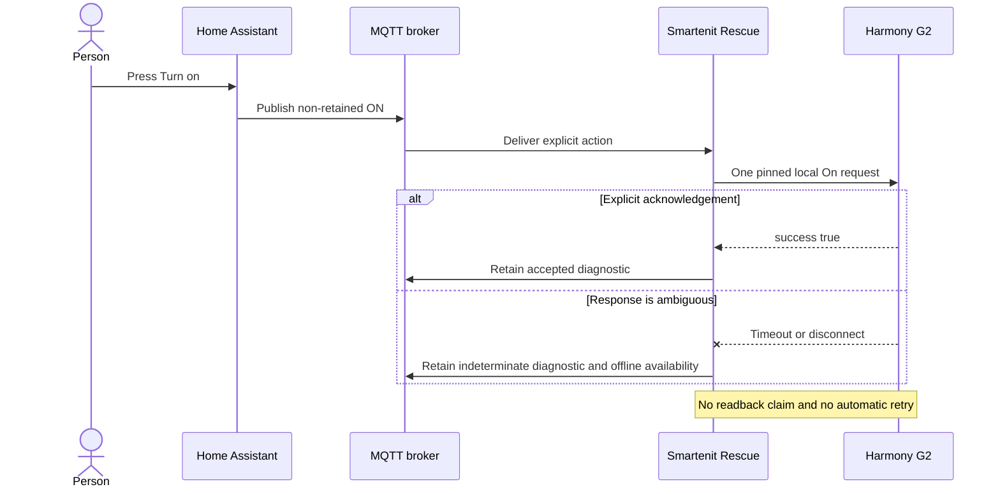

# Architecture

Smartenit Rescue is a thin interoperability bridge for Smartenit devices whose
original application or cloud service is unavailable. It provides device identity,
capability translation, trustworthy state, and integration boundaries. Home
Assistant or another automation system remains responsible for dashboards,
automations, schedules, history, users, and remote access.

The repository contains canonical domain models, validated declarative device
profiles, offline profile tooling, release privacy checks, and a foreground MQTT
runtime. The runtime supports a reserved observable simulator and an experimental,
command-only Harmony G2 backend. The generated G2 protocol proof is not a claim of
physical-device verification.

## Design principles

- Report only defensible state. A command acknowledgement does not prove physical
  device state.
- Use explicit desired values such as On and Off. Do not expose ambiguous toggle
  commands.
- Never replay a physical command automatically after an ambiguous failure.
- Preserve a device's physical identity while its transport backend changes.
- Reject unknown devices, capabilities, response shapes, and values instead of
  guessing.
- Keep support claims tied to public evidence and reproducible hardware results.
- Keep private installation data, credentials, captures, and operational history out
  of the public project.

## System boundary

The runtime architecture is:

```text
Home Assistant <--> MQTT broker <--> Foreground bridge <--> Backend interface
                                                              |
                                      Simulator (observable) --+
                                      Harmony G2 (command-only)-+
                                      Zigbee2MQTT (future) -----+
```

Consumers interact with the canonical facade rather than a particular gateway. This
keeps device and entity identifiers stable during an incremental move from Harmony G2
to another Zigbee coordinator and prevents multiple integrations from claiming the
same device.

## Proving the bridge without hardware

The synthetic proof exercises the public runtime boundary without claiming physical
device support. It uses the reserved example device, the same MQTT topics and Home
Assistant discovery generator that a future hardware backend must use, and an
in-memory simulator that accepts explicit desired states.



This flow proves the integration plumbing and its failure boundaries:

- Home Assistant discovers a non-optimistic switch through standard MQTT discovery.
- Every user action carries an explicit `ON` or `OFF` desired state. The bridge never
  turns an ambiguous toggle into a device command.
- State and confidence remain unavailable until the bridge has refreshed an
  authoritative snapshot and opened both availability boundaries.
- Home Assistant and broker restarts recover the latest observation without replaying
  a command.
- An abrupt bridge stop publishes its retained last will, which makes the entity
  unavailable until the bridge returns.

The simulator proof does not validate Zigbee transport, radio pairing, controller
firmware, or physical load state. A separate generated-certificate integration test
proves the G2 software path—local renewal, exact inventory mapping, command submission,
ambiguity, and no replay—without claiming household hardware verification.

## Canonical model

The model separates physical identity, backend-local identity, capabilities,
observations, availability, and command outcomes.

- `DeviceId` is a normalized Zigbee EUI-64 and is the stable identity of a physical
  device.
- `EndpointId` remains explicit, including for single-endpoint devices.
- `CapabilityId` provides a stable vocabulary such as `on_off`,
  `electrical_power`, and `temperature`.
- `BackendBinding` contains transport-specific identifiers that do not participate in
  public identity.
- Bridge availability and device availability are distinct signals.

Names, model strings, Zigbee short addresses, and suffix matching are not sufficient
to manufacture a canonical identity. When a backend cannot provide an authoritative
EUI-64, an operator must supply an independently verified private binding before the
device can be published as controllable.

## State and command semantics

Every observation carries a confidence value:

- `observed`: confirmed by a fresh device report or readback;
- `assumed`: inferred from an accepted command without device confirmation;
- `stale`: formerly observed but outside its freshness policy; or
- `unknown`: no defensible value exists.

Command results remain equally explicit:

- `rejected`: the command was not accepted for submission;
- `accepted`: the backend accepted it, but physical state is unconfirmed;
- `confirmed`: fresh evidence confirms the resulting state; or
- `indeterminate`: the outcome cannot be established safely.

An accepted command cannot create an observed state. Restored or retained data keeps
its original observation time and must be re-aged after restart. Late observations
must not overwrite newer ones.

Runtime capabilities identify one of two access modes. An `observable` capability has
authoritative readback and can publish a non-optimistic switch, state, and confidence.
A `command_only` capability publishes explicit action buttons and a retained
last-command diagnostic, but no state topic. Its accepted outcome is not physical
state. Availability describes the authenticated backend binding, not whether the
attached load is currently On or Off.

MQTT command messages use QoS 1 and are not retained. QoS 1 permits redelivery, so a
backend may receive the same desired value more than once. Backend setters must be
idempotent: repeated `ON` means make or keep the capability on, and repeated `OFF`
means make or keep it off. The application does not retry received commands, and it
makes no exactly-once guarantee for physical execution. A fresh operator action is
required after an ambiguous outcome.

## Device profiles

Device profiles are declarative JSON documents validated against a closed,
versioned schema. They contain no executable code. A profile records matching
evidence, endpoints, clusters, capability-to-driver mappings, normalization rules,
freshness policy, limitations, provenance, and support level.

Support labels describe evidence rather than aspiration:

- `synthetic`: validated with fixtures and public documentation only;
- `experimental`: exercised with hardware but not sufficiently verified for a stable
  compatibility claim; or
- `hardware_verified`: verified on hardware with reproducible evidence.

Adding a profile that uses existing drivers should remain data-only. New protocol
behavior requires a typed driver, failure-semantics review, tests, and public
provenance.

## Backend boundary

A backend is responsible for inventory, profile matching, supported reads, explicit
commands, observations, and availability. It returns structured command outcomes and
may reconnect or restore state without replaying commands.

The Harmony G2 adapter accepts only an externally provisioned local session. It pins
the configured gateway certificate before sending credentials, rejects redirects and
unknown response envelopes, bounds response data, maps exact EUI-64/component pairs,
and performs no automatic retry or command replay. Acknowledged On/Off is `accepted`,
never `confirmed`, because trustworthy relay-state readback has not been established.
Cold bootstrap is not supported, and no silently selected cloud endpoint belongs in
the package.



The second project objective is a direct-controller route through a replacement
Zigbee coordinator, without Harmony G2 hardware or the vendor cloud. This requires
new coordinator hardware and controller migration; it has not been implemented or
verified. The planned Zigbee2MQTT adapter will key devices by EUI-64, use a dedicated
broker subtree, submit non-retained explicit commands, and translate bridge and
device availability separately. Native Zigbee2MQTT discovery and the Smartenit
Rescue facade must not own the same Home Assistant entity simultaneously.

## Home Assistant and MQTT

MQTT Discovery is the first intended Home Assistant integration. The synthetic Home
Assistant path has been tested. Node-RED, openHAB, and direct MQTT consumers are
potential integrations, not tested or verified consumers in this release. The MQTT
boundary does not tie the package to Home Assistant's internal Python APIs.

Discovery identifiers and canonical topics remain backend-neutral. Discovery is
non-retained. Authoritative state and confidence are retained at QoS 1 so a consumer
that subscribes after processing discovery immediately receives the latest
observation. This closes the discovery-to-subscription race without making the switch
optimistic.

Bridge and device availability are retained at QoS 1, including a retained bridge
last will, and form the validity boundary for retained observations. An offline
availability value makes a stored state unavailable; the bridge refreshes its
authoritative snapshot before publishing the online boundary. Commands remain
non-retained, and received retained commands are rejected. Home Assistant birth and
broker reconnect handling republishes discovery and the current snapshot without
synthesizing freshness or resubmitting a command. For observable capabilities, the
broker persists canonical state and confidence. For command-only capabilities, it
persists only a last-command diagnostic for operator visibility. That diagnostic is
history, not an executable or replayable command.

## Migration

Migration changes a private backend binding while preserving the canonical EUI-64 and
consumer-facing identifiers. It is performed one device at a time, verifies the
destination identity, requires an explicit Off before normal command flow, and keeps a
tested rollback path. A different EUI-64 is a replacement device, not the same device.

The project does not automate physical leave, reset, pairing, permit-join, electrical
work, or coordinator firmware operations.

## Privacy and provenance

The public repository is independent of private deployments. Public behavior must be
re-authored from public documentation, appropriately licensed code, or sanitized and
independently reproducible observations. Synthetic fixtures use reserved example data.
Source, documentation, history, dependencies, and release artifacts are scanned for
private identifiers, secrets, and local-only dependencies.

## Non-goals

- An automation engine, dashboard, scheduler, history service, or user system.
- A hosted cloud service or remote-access relay.
- A replacement Home Assistant frontend.
- Bundling Home Assistant, an MQTT broker, or Zigbee2MQTT.
- Automatic physical commands during startup, shutdown, retry, recovery, or
  migration.
- Compatibility claims that exceed the available evidence.
